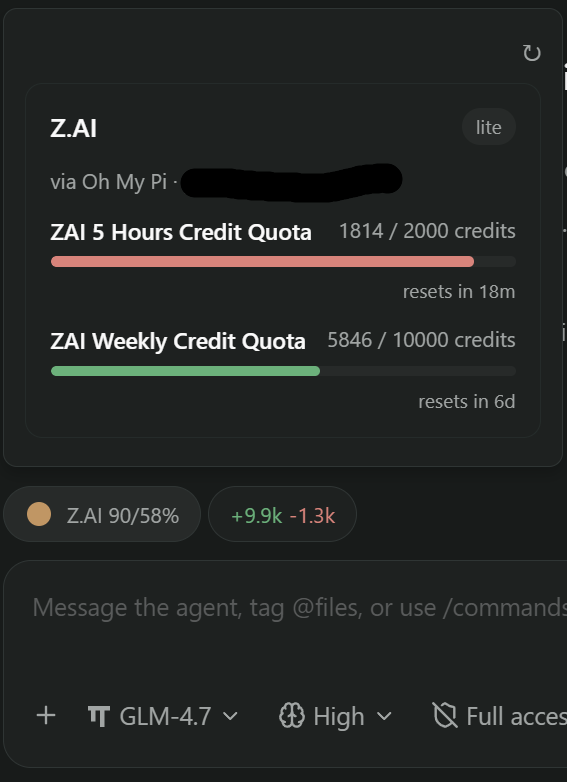
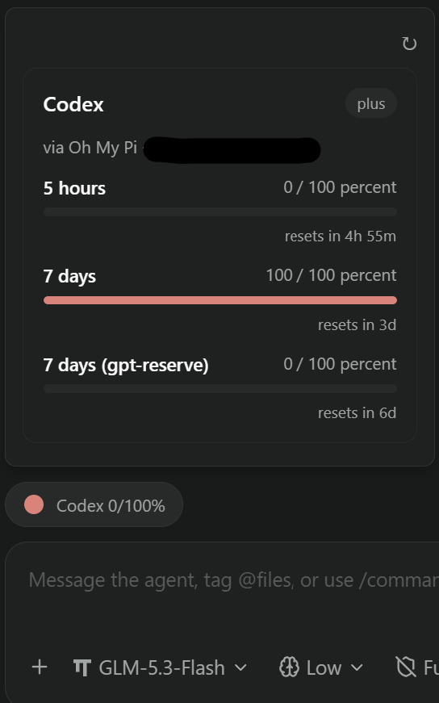
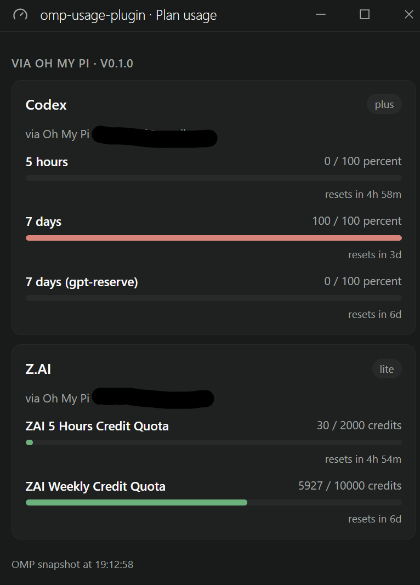

# omp-usage-plugin

A local [Paseo](https://paseo.sh) plugin that surfaces your [Oh My Pi](https://omp.sh) (OMP) plan quotas — composer pill, popover, workspace panel, and a settings screen.

OMP is the agent harness behind Paseo's `omp` provider. Its CLI (`omp usage --json`) reports per-provider credit quotas with rolling windows; this plugin puts those numbers where you can see them while you work.

## Surfaces

| Surface | What it shows |
| --- | --- |
| **Composer pill** | `Z.AI 14/43%` — short provider name (`Codex`, `Go`, `Z.AI`) plus the rounded percentage of every window that applies to the agent's current model, joined under one `%`. A tick next to the name carries the color, matching the card bars: green below 70%, amber from 70%, red from 90%. Click opens the popover. |
| **Popover** | One card for the current model's plan: provider, plan label, account email, per-window percentage colored by the same thresholds, credit bars with absolute spend (`548 / 2000 credits`) and reset timers (`resets in 4h 5m`). Model-scoped quotas (Spark, gpt-reserve) sit apart in a `Model quotas` group. A `↻` button forces a fresh fetch, bypassing the daemon-side cache. |
| **Workspace panel** | The same cards in the agent panel (`Plan usage`), for workspace and explorer locations. |
| **Settings screen** | Settings → Plugins → Plan usage: every OMP subscription found by the CLI, with the snapshot timestamp. |
| **Command center** | `Open plan usage` opens the panel. |

## Screenshots

| Z.AI plan | Codex plan | Settings screen |
| --- | --- | --- |
|  |  |  |

## Plan binding and fallback

- The pill and popover track the **agent's current model** (`provider/model-id`). The model prefix maps to the usage provider with the same id: `zai/glm-5.3-flash` → `zai`, `opencode-go/deepseek-v4-flash` → `opencode-go`, `openai/gpt-5.4` → `openai-codex`.
- When OMP hits a quota wall mid-turn it falls back to another provider and logs a `retry_fallback_succeeded` timeline event. The plugin then shows the **fallback plan** instead.
- Fallback freshness: OMP's fallback is sticky per agent process, and timelines keep old fallback events forever. Live timeline events (arrived while connected) always count; events replayed from history count only while the agent is mid-turn. That way a stale fallback from before a restart does not stick to the pill.
- The daemon exposes no "current model" field for OMP, so this inference is the best available signal.

## Windows and model-scoped quotas

`omp usage --json` reports two kinds of quota:

- **Account-wide windows** (`scope.tier` absent) — the plan itself, e.g. Codex's 7-day window or Z.AI's 5-hour and weekly credit quotas.
- **Model-scoped windows** (`scope.tier` plus `scope.modelId`) — a side budget for one model, e.g. `spark` (`GPT-5.3-Codex-Spark`) and `base-model-inference` (`gpt-reserve`).

The pill takes every account-wide window plus model-scoped windows whose `modelId` matches the agent's model. OMP reports the model's display name while the agent carries the selector, so the comparison normalizes both (`GPT-5.3-Codex-Spark` matches `openai-codex/gpt-5.3-codex-spark`). A tier without a model id, or one matching no selectable model — `gpt-reserve` today — never reaches the pill; the cards list it under `Model quotas`.

Windows render shortest first: 5 hours, week, month. `monthly` carries no `durationMs` in the CLI, so it is ranked after every timed window explicitly. A window the CLI reports without `usedFraction` shows `—` instead of `0%`.

## Refresh cadence

- Client polls every **5 minutes**.
- The plugin server caches one CLI snapshot for **60 seconds** no matter how many clients ask.
- Model changes and fallback events update instantly via subscriptions.

## Architecture

```
index.client.tsx        client entry: pill manager + panel + settings + command center
index.server.ts         server entry: handles the omp-usage.get RPC
server/omp-usage.ts     spawns `omp usage --json`, validates with zod, caches 60s
client/pills.tsx        pill manager: agent snapshots, pill sync, fallback watcher
client/usage-popover.tsx  popover with per-window cards + refresh button
client/usage-panel.tsx  workspace panel
client/usage-settings.tsx settings screen
shared/usage.ts         RPC schema, provider/model mapping, window selection, pill text
```

The server runs one `omp usage --json` spawn per snapshot (15s timeout, 10 MB output cap), validates the payload once, and serves every client from that snapshot. The client keeps a snapshot cache per agent so `useSyncExternalStore` gets stable references.

## Install

Requirements: Paseo `>=0.8.0` and the `omp` CLI on the daemon host (override with `OMP_COMMAND`).

Directory source (local checkout):

```bash
paseo plugin install /absolute/path/to/omp-usage-plugin
```

Git source:

```bash
paseo plugin add <owner>/omp-usage-plugin
paseo plugin update omp-usage-plugin
```

No build step is declared — the host compiles the TypeScript itself. Reload from Settings → Plugins → omp-usage-plugin after editing a directory source.

> Plugins are unsandboxed: installing one means trusting its code. This plugin only shells out to the local `omp` CLI and talks to the Paseo daemon; it makes no network requests of its own.

## Plans shown

Anything `omp usage --json` reports — today `zai`, `opencode-go`, and `openai-codex`. The popover filters to the agent's current plan; the settings screen lists all of them.

## Development

```bash
npm install
npm run typecheck
```

`npm run typecheck` is the only check needed; the host owns compilation and loading. Full Paseo test suites are heavy — run them from the Paseo checkout only if you changed it.

## Troubleshooting

- **No pill**: the agent's model has no matching usage report (plan not configured in OMP, or the CLI is missing/unauthenticated). Check `omp usage --json` on the daemon host.
- **Stale numbers**: within the 60s server cache; use the popover's `↻` for a forced refresh.
- **Plugin errors**: Settings → Plugins → omp-usage-plugin → logs, or `paseo plugin logs omp-usage-plugin`.
